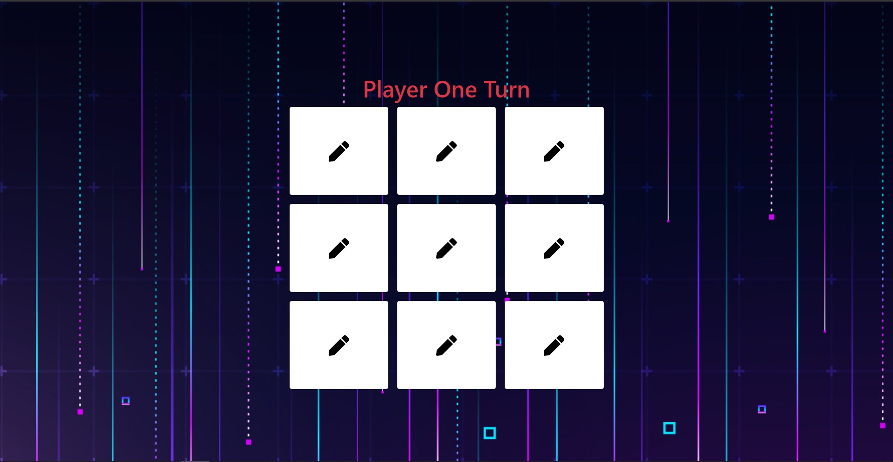
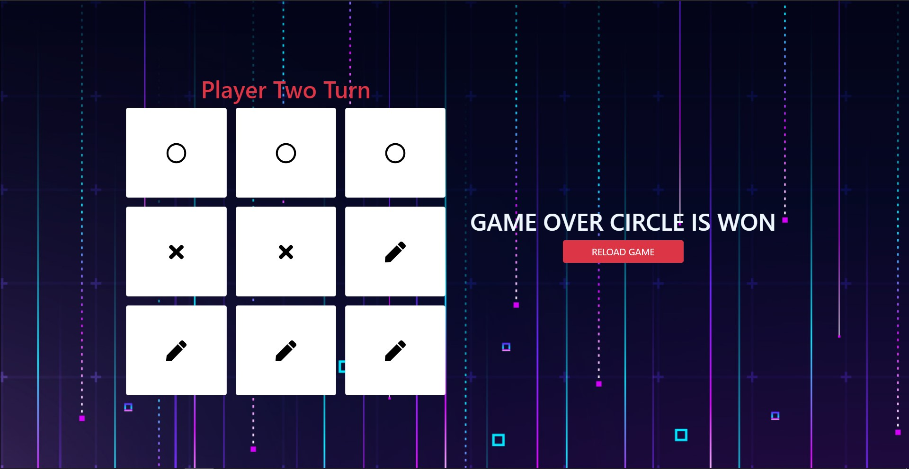
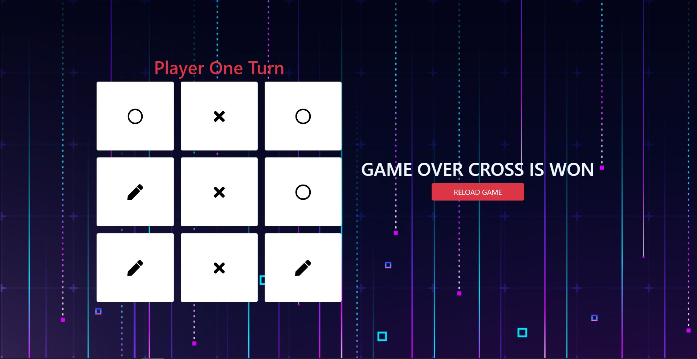

# TicTacToe

This project was generated with [Angular CLI](https://github.com/angular/angular-cli) version 11.0.5.

## About

This is a Simple Tic-Tac-Toe Game. Where two users compete themselves and one will be the winner.

- Initial Game Looks like this
  

- After Player Won the Game
  

- You can win in any Direction, if all three matches in-line
  
  

## Rules

- Player can click only one box at a time.
- If already one box is clicked and try to click that one you will get error message.
- If no box is empty then the game is complete.

## Development server

Run `ng serve` for a dev server. Navigate to `http://localhost:4200/`. The app will automatically reload if you change any of the source files.
